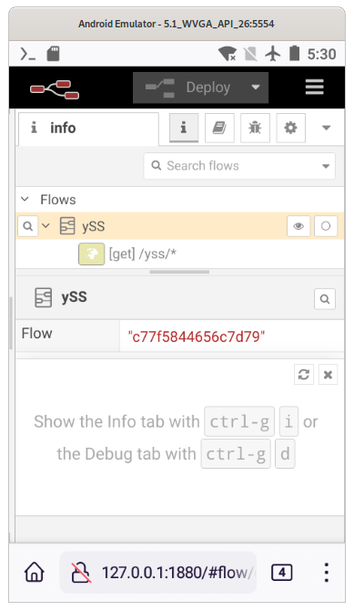

# OTDM installation for termux (android devices)  

This is a step by step manual how to get from Vanilla termux on android to running otdm-yss on it. It's an entry point to start to use otdm- family  

Big Kudos to the Termux team !  

Termux can be downloaded from their [github repository](https://github.com/termux/termux-app). On the page you can find "Releases" and download what you need for your device. It can also be installed from [F-Droid](https://f-droid.org/en/packages/com.termux/)


## Steps to install
- On Android device Install [Termux](https://termux.dev/en/) from downloaded .apk file.

- Copy this line:
 ```bash
curl https://raw.githubusercontent.com/yOyOeK1/oiyshTerminal/main/installer/run2.sh > ./run2.sh; . ./run2.sh
```
- Start termux and past the line 
- Confirm with Enter

- This will download basic installer for termux and start the installation process 
- On the way it will ask some questions (If you dont't know the answer, Yes will probably work best ;) ) 

- [x] Done - you have otdm-yss on your android device  
  
  

|  |  |
| ------------------------------- | ----------------------------------- |

Android emulator with oreo. On desktop firefox shortcut to http://127.0.0.1:1880/yss


|  | otdm-node-red-installer - Node-red on device. This is a status after installing otdm-yss. By dependency you got running Node-RED instance |
| ------------------------------------------------------------------------------ | ----------------------------------------------------------------------------------------------------------------------------------------- |


|  | otdm-nrf-ot-test - is a fast and easy place to see what is OK in otdm enviroment |
| --------------------------- | -------------------------------------------------------------------------------- |


## What next?

It's only a start. But it's a good start. More info on progress can be found [here...](https://github.com/yOyOeK1/oiyshTerminal/blob/fromZeroToHero/otdm-ubuntu-vanilla-install.md)


By using command: `$ apt-cache search otdm` you will get all packages currently in the repository.
***
To write this document I used oreo android x86_64 in virtual machine and Termux in version 0.118.0.
