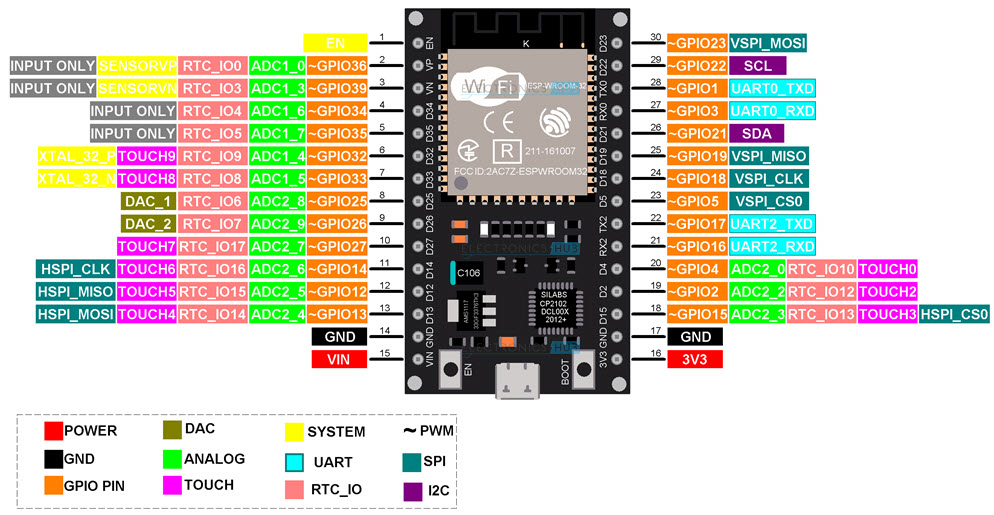
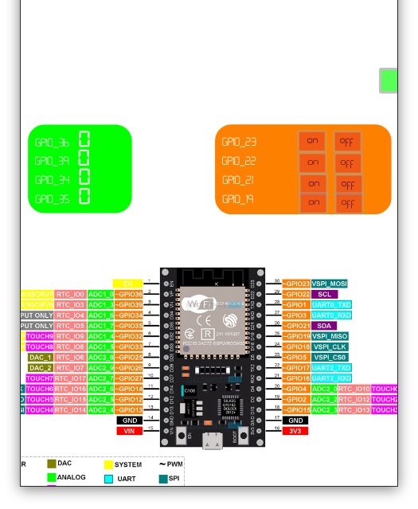
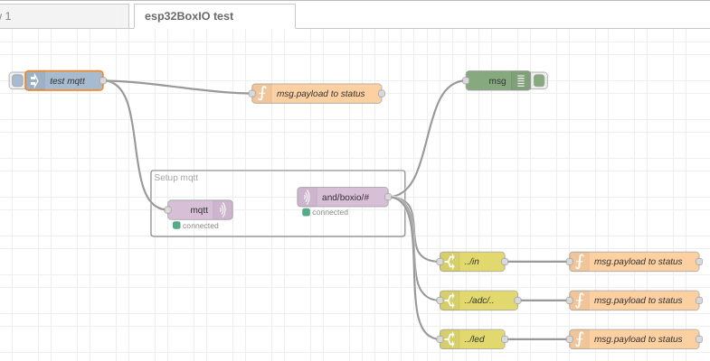

# esp32 box io v1

Arduino-ide part.
Center of the party is esp32 - n4 with 30 pin dev board.
Box is going over list of essid's. Then connect to ip and port of mqtt broker start publish states of GPIO's.


## hardware

#### esp32 - N4 30 pin version


This is in 99% similar to one what I have :)


## configuration

In file for **arduino-ide** located in `./esp32iobox2/esp32iobox2.ino` edit sections ...

```c
char *boardModel = 'esp32_30pin';
int boxioNo = 1; 
char *OTAPass = "bob"; // OTA password
char *ap_ssid[] = {  "apHome",        "DIRECT-7u-SecureTether-svOiysh7" , "HUAWEI Y7a"           };
char *ap_pass[] = {  "123456789",     "9egHgaWh",                        "srytyfrytybangbang"  };
char *mq_server[] = { "192.168.1.1",  "192.168.49.1",                   "192.168.43.1"  };
char apCount = 2; // count of Access points starting from 0 

int mq_port = 10883;
```

* *ap_ssid* list of ESSID's to try to connect
* *ap_pass* list of passwords to ESSID's
* *mq_server* list of mqtt server brokers on every access point
* *apCount* count of essid's to try. Count from 0
* *mqClient* name of this **box-io**
* *boxioNo* channel for this box-io to publish on
    * `and/boxio/**boxioNo**/adc/..` - adc readouts of GPIO 36, 39, 34, 35
    * `and/boxio/**boxioNo**/in` - `payload` jsstr of GPIO `{23:[1|0],22:[1|0],21:[1|0],19:[1|0]}`


## io-box and mqtt

Raporting is on mqtt in topic `and/boxio/1/...` where `1` is your `boxioNo`. In this example we will use `1`


#### periodic raports

Logs from mqtt.
```bash
Client mosq-FhBwMbyXK6OKUINkol received PUBLISH (d0, q0, r0, m0, 'and/boxio/1/box', ... (99 bytes))
{"ip":"192.168.43.10","dbm":-32,"chipTemp":62.22,"boardModel":"esp32_30pin""adcHz":1,"touchRou":10}
Client mosq-FhBwMbyXK6OKUINkol received PUBLISH (d0, q0, r0, m0, 'and/boxio/1/settings', ... (152 bytes))
32:R:0,33:R:0,4:O:0,5:O:0,15:O:0,16:O:0,17:O:0,25:D:0,26:D:0,18:I:0,19:I:0,21:I:0,22:I:0,23:I:0,34:A:0,35:A:0,36:A:0,39:A:0,13:T:0,12:T:0,14:T:0,27:T:0,
```
We got state and basic information on io-box and current state and types of all used GPIO's pins. 


#### new pin state found will be send as

Logs from mqtt
```bash
Client mosq-zq88SrLuBPZgPDmUn4 received PUBLISH (d0, q0, r0, m0, 'and/boxio/1/s/33', ... (1 bytes))
2
Client mosq-zq88SrLuBPZgPDmUn4 receiv.........
```
This is information from io-box about `GPIO33` change state to `2`


#### io-box do x with pin

Sending command's to io-box is over mqtt to topic's:

"and/boxio/1/adcHz" int[1...10] - to set Hz of refresh
"and/boxio/1/p" "GPIONO:[0|1]" - to set state (Digital pin out)
"and/boxio/1/d" "GPIONO:[0..255]" - to set state (DAC)
"and/boxio/1/la" [0|1] - turn on/off logic analizer on GPIO18. Can do up to 39400bits sampling no error's more on **id-box** / **logic analizer**


## debuging 

* **viteyss-site-ioboxContact** [(repository)](https://github.com/yOyOeK1/viteyss-site-ioboxContact) 
    graphical interface to see / set state on io-box (check debugging section)


* on yss
    **node-yss** is comming with some preinstalled **site**'s to play with. One of theme is **multiSvg**. On this site you can find `boxio1Debug.svg` 

    


* node-red boxio1 test flow
    So there is a flow for Node-RED to include. [boxio1_boxio1_testFlow.json](./examples/boxio1_testFlow.json)

    

    * can test mqtt pass and connection
    * showing incomming raports from boxio1 from input: ADC, GPIO's
    * TODO inject to set pin state


## links

Useful links:
* https://github.com/espressif/arduino-esp32