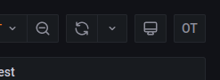
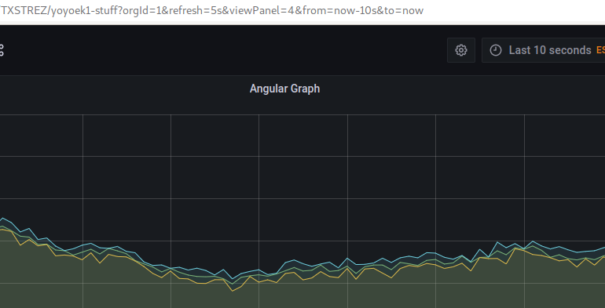
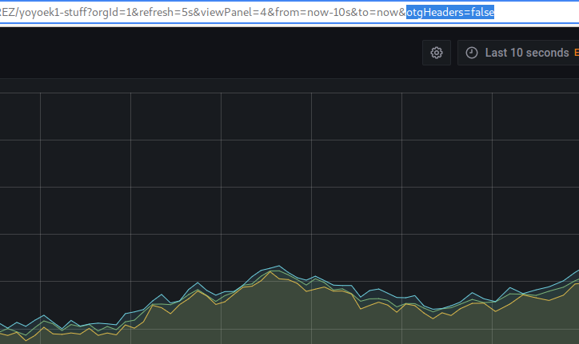
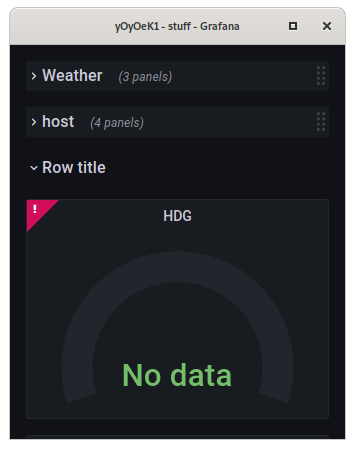
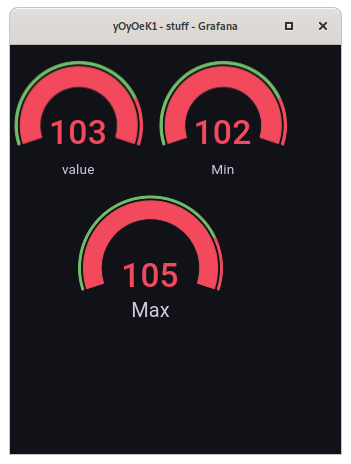
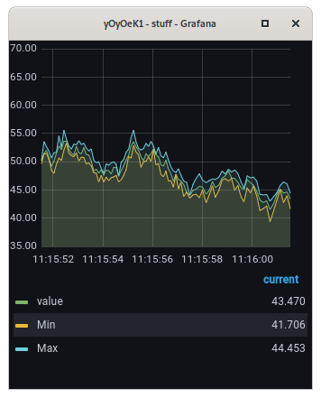

## otdm-grafana-btzoom

   Is a tiny .js file injection to index.html template of grafana. This step allow as to call this status as "Wear in moment". So currently as a first try of making it it have a list of functionality. By requesting url with arguments:


- otgHeaders=**[true:default|false]** - to show or hide page-title's
* otgOnly=**[number]** - number of panel witch maxis it to extreme :)


## 100% manual installation

In your grafana directory

* you have `./grafana/public/lib/` copy `otGrafanaBtZoom.js` to it.

* add at end of `./grafana/public/views/index.html` new line with ...

  ```html
  <script src="public/lib/otGrafanaBtZoom.js"></script>
  ```

* reload grafana page and you will get new button in top bar tools

  


## from deb installation

TODO is comming ...


## status

working / usable / not installing correctly only manual installation


## screenshots


* show / hide page-title's



*above is default view of a example page. Below is with &otgHeaders=false argument*




Maximize it as `otgOnly` argument. First image shows default view



*lot of element around element with data. And bellow with `otgOnly=1` in this case is this...*

 or 

*absolutely nothing else shown in kiosk mode of browser*


## notes

Nice!
