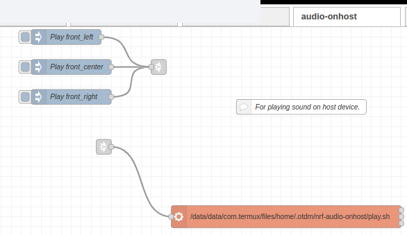
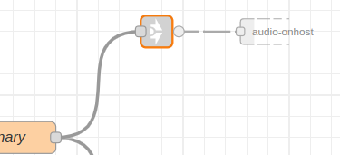

# otdm-nrf-audio-onhost

It will give you a link `play audio on host` to which you can send `msg.mp3` as a `String` path to .mp3 | .wav file.

It handle platform difference debian use mplayer (fast no farts on start), aplay

Termux termux-media-player

Flow in Node-RED

And link geting `msg.mp3`

## Installation / uninstall

This is handle by dpkg / otdm system. If you have it in flows it will tell you that. If you modify it it will not remove it.
