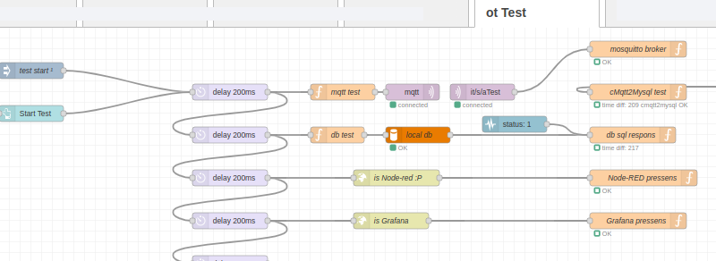

# otdm-nrf-ot-test

Node-RED flow for testing oiyshTerminal status. It checks:

- mosquitto is running

- cMqtt2Myqsl is running

- data base helth

- Node-RED is running

- Rgafana is running 

- more is coming..

Node-RED Flow

## Installation / uninstall

This is handle by dpkg / otdm system. If you have it in flows it will tell you that. If you modify it it will not remove it.
