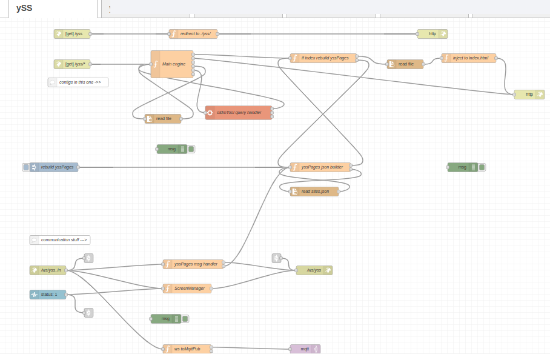

# yss-nrf-yss

This one will install if it's not there a flow for yss back-end. It sets flow with:

http hosting, build index's for dynamic package handling, host webSocket at :1880/yss and :1880/yss_In for communication.

Node link `ws_yss_In` is for you if you want to extend functionality.

Node link  `ws_yss` is for you if you want to extend functionality.

Node-RED flow

## Installation / uninstall

This is handle by dpkg / otdm system. If you have it in flows it will tell you that. If you modify it it will not remove it.
