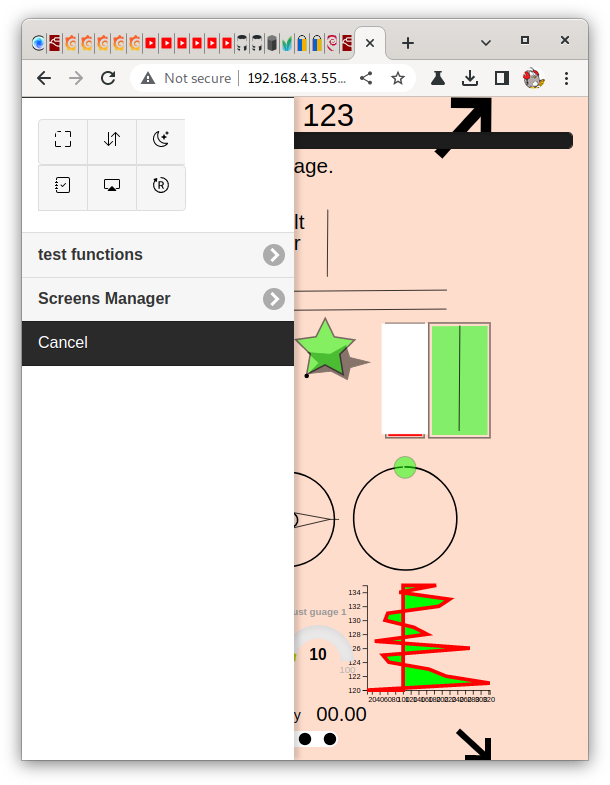
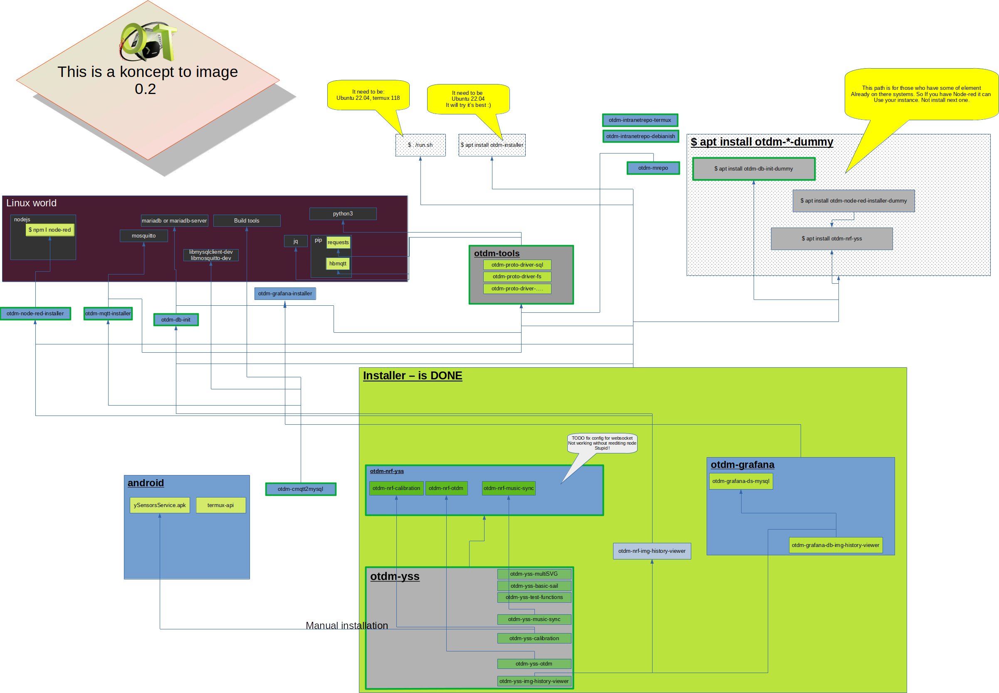

# otdm on fresh ubuntu 22.04

*( branch: From zero to Hero )*

This is a description with step by step process to get from fresh ubuntu 22.04 to running yss on it.

For this document I'm using installation of ubuntu 22.04 (lts after update and upgrade of system)  

**it's not final version**.

**One of a first .deb base.**


## Installation steps

In terminal of your flavor run commands ...

```bash
$ echo "deb [trusted=yes] https://raw.githubusercontent.com/yOyOeK1/oiyshTerminal/fromZeroToHero/OTDM/ ./ " | sudo tee -a /etc/apt/sources.list.d/otdmFromZetoToHero.list
$ sudo apt update
$ sudo apt install otdm-yss
```

**!! important !!** - check what apt is proposing you to do. If you have any stuff like
Node-red, mysql, mosquitto, mariadb you need to first install otdm-*-dummy package to
stop package manager dependency manager to reinstall your stuff.


## Known bugs

- [ ] [newer Node-red?] In current version of **otdm-node-red-installer** (0.1.11) it's installing Node-red in version 2.1.5. In this version there is a need of manually setting up websockets nodes Sometimes :| 
  
  At http://yourIp:1880 you have now Node-red. In it flow with name "ySS", node need to be found: /ws/yss_In and /ws/yss
  
  Both need to be set up with Path according to the name.

- [ ] otdm-nrf-yss (0.1.17) also not set up correctly node "Main engine" In it set your values of your system. Don't know how to get in nice way your local external ip in this mess of interfaces.

```javascript
msg.yssWSUrl = "ws://192.168.43.220:1880/ws/yss";
```

*msg.yssWSUrl** - change **only ip address** to yours in local network set only ip this flow is making you ws:// on those paths

And Deploy.

Last step is to set external sites. You can do it by editing sites.json in yss directory. By running

```bash
$ node /data/data/com.termux/files/home/oiyshTerminal/ySS_calibration/sites/sites.json
```

Edit section to your needs. You can turn on / off sites or add yours!

Ctrl+x (to exit) and Ctrl+y (to confirm saving)


## First finecy visit

First opening of a page is most of the time wrong. It's building index's and other things. It's only on first opening of a page after deploy.

All is now good. So open a web browser and enter http://yourIp:1880/yss

Let me know what you think about it.

You will in menu only two things: 

- test functions - to help you start with custom .svg pages and the yss system

- Screens Manager - to have remote control to all your screens

 

So you can start to play with it now. Or look for more .deb's in apt repository with prefix otdm-


## Current status of otdm flow



**Green frames** - Ok

**Different color of frame** - in progress


## First installations

Installation on fresh Ubuntu


[link to video ...](https://www.youtube.com/watch?v=wwGxnr0Obqw)


## More is coming !!!

If you like buy me a coffee
[](https://ko-fi.com/B0B0DFYGS)
