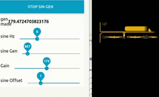
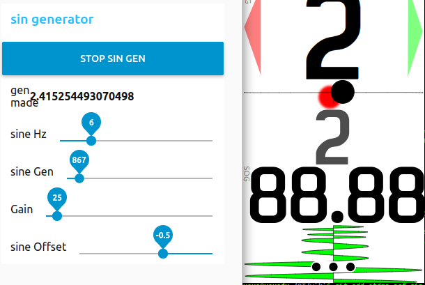
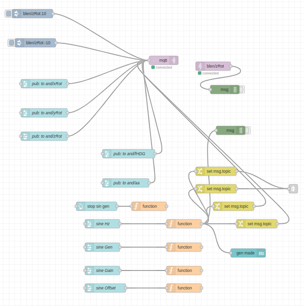

## otdmp-nrf-sin-generator

   Is to generate some sine wave numbers. And have some sliders to make some fake data flow for your tests ...

Have some sliders to broadcast data to your site to check how it's reacting. And have nice sine wave generator. 

## status

usable / not tested in installation 

## screenshots

*flow in Node-RED so it's customization!*

## notes
