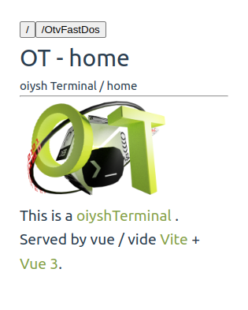
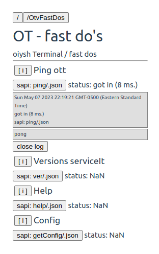

# otv3

  This is a oiyshTerminal with Vue 3 in Vite. Same idea as otdm monstrosity but with npm's ?

## Recommended IDE Setup

   TODO

## Reference list

  See [otdm idea Wiki](https://github.com/yOyOeK1/oiyshTerminal/wiki/otdm-yss-otdme)
  See [otdmTools.py Wiki](https://github.com/yOyOeK1/oiyshTerminal/wiki/otdm-tools)
  See [otdmTools.py -serviceIt README](https://github.com/yOyOeK1/oiyshTerminal/blob/main/otdm-tools/data/data/com.termux/files/usr/bin/otdm_serviceIt_README.md)
  See [sapis README](https://github.com/yOyOeK1/oiyshTerminal/blob/main/otdm-tools/data/data/com.termux/files/usr/bin/otdm_sapis_README.md)
  See [Vite Configuration Reference](https://vitejs.dev/config/)

## Project Setup

TODO in progress

- [x] node 16.x or up 
  
  - [x] **on ubuntu 22.04**
    
    ```bash
    curl -sL https://deb.nodesource.com/setup_16.x | sudo bash -
    ```
    
    *check version of your node after if it's 16.x or up*

- [ ] TODO get source / files of `otv3`

- [ ] TODO set up `otv3.config.json` to your needs

- [ ] 

- [x] in directory of `otv3` run it by
  
  - to install dependencies
    
    ```bash
    npm i
    ```
  
  - to start it
    
    ```bash
    npm run it
    ```
    
    *this will start `vite` server at ports frow config file `./otv3.config.json`*

## Status

- [x] start it

- [x] take some control

- [x] otVes
  
  - [x] Home for otv3
  - [ ] clv(msg...) - for loging 
  - [x] fast do's

- [ ] reorganize file position to be more `include` like 
  
  - [ ] package bundle *check `DOCS/vuejs-docs/docs/src/examples/src` is nice. Can it be ?*
    
    - [ ] **OtDesc.json** to set what is whit `this one`
    - [ ] **Otv...** as ot Vue set so it will have it set of ...
    - [ ] **Otc...** as Component to use as describe
  
  - [x] **alias** `vite.config.js` have entry's on `@...`
    
    - [x] `@yss-libs` to `yss/libs`
    - [x] `/otv3Config` to get config of `otv3` as  `.json`

- [ ] sapi - make contact with otdmTools.py
  
  - [x] establish communication
    
    - [x] over `mott`
    - [x] over `OTGet`
  
  - [ ] `getSapisList` - to build vectors
  
  - [ ] `ver` - is of serviceIt some interaction with serviceIt
    
    - [ ] start
    - [ ] stop
    - [ ] status
    - [ ] logs
  
  - [ ] `.md2html`

- [ ] start yss-blank

- [ ] start some ./libs/m*.js from yss
  
  - [ ] mWebSockets need fixups - working
  
  - [x] motTools.mjs - is now looking like multi compatible with some hacks on .js / yss way EXAMPLE to copy?
    
    - vite is       
      
      ```ts
      import {motTools} from './assets/ySS_calibration/libs/motTools.mjs'
      const mott = new motTools();
      mott.sapiJ( 'ping', (d)=>{console.log('got data from mott:',d);} )
      ```
    
    - otdm-yss is       
      
      ```js
      mott.sapiJ( 'ping', (d)=>{console.log('got data from mott:',d);} )
      ```
  
  - [ ] start yss on vue

## ideas - only

**otvmddb** - `.md` / folders `data base`

    folders are like `tables` but in this case you can use `/` to access your `records` yyy files `.md` Some definition of wrapper to define how to render `table`

## Screenshots

| Image / picture / video                                                                            | Description                                                                          |
| -------------------------------------------------------------------------------------------------- | ------------------------------------------------------------------------------------ |
|                                                                 | Current status of Home page is a start. Router is working                            |
|                         | otv as view - fast do. In contact over http with otdmTools.py running serviceIt Ping |
|  | Lot of logs for now                                                                  |
|                                                                                                    |                                                                                      |

## talking over http to otdmTools

Yes this is one argument from you.`otdmTools.py -serviceIt http` this will start `serviceIt` with `http` interface and `sapis`!

```bash
otdmTools.py -serviceIt http
args after parser:{'serviceIt': 'http'}
. . o o O O  oiyshTerminal - tools  O O o o . .ver 0.27.10

[ WARNING ] clip file (1227)
[ i ] InjectDrivers acts len 24 found drives 9...  +   +   +   +   +   +   +   +   +  
serviceIt .... starting 1683518324
so debug is - at ServiceIT
{'serviceIt': False, 'sts': False, 'sapis': False}
    serviceIt ... mqtt ... NO
    serviceIt ... http ... YES
[ i ] ServiceIt [ http ] in ver 0.0.1 init ....and register sapis 24
    serviceIt ... ws ... NO
    serviceIt ... xmlrpc ... NO
serviceIt enter main loop ....
192.168.43.220 - - [07/May/2023 22:58:54] "GET /ping/.json HTTP/1.1" 200 -
192.168.43.220 - - [07/May/2023 22:58:57] "GET /ver/.json HTTP/1.1" 200 -
```

*ping in .json wrapping request on GET and version of serviceIt same as .json*
