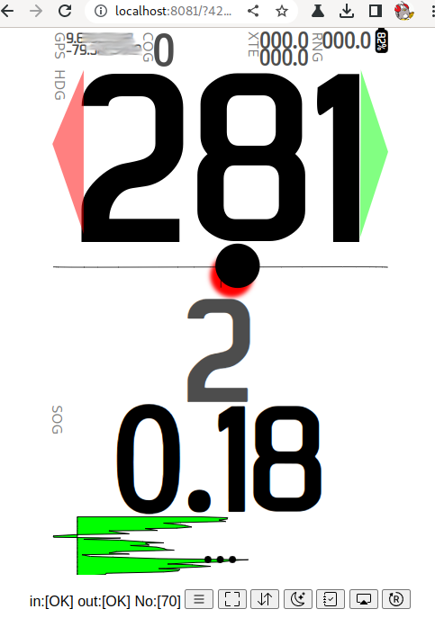
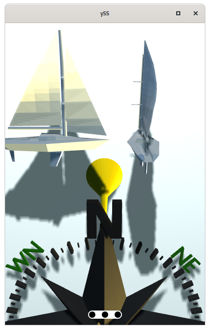

# What is in it ?

**yss** Is a set of helping functions and mechanisms to get a web browser page with menu, shaders, colors invert, red-black, rotation, ... It also provides a remote Screens Managment functionality (in action: https://www.youtube.com/watch?v=fz_WaZtpGYo).

It gives you access to librarys: three.js, jquery, jquery mobile, d3.js, svg.js, websocket, rapheal, ml5, ..... It will be a base to start with your site for your need. It's now coming with some examples. But nothing is obligatory :) You can fill free to edit any section of the project and if you create something cool share with all of as!

---

# Introduction

**!! It's in progress !!** current version of yss in the process of big transformation.

It is a part of a oiyshTerminal ecosystem. As a solution to have an alterative to node-dashboard or other custom-built web pages. It is providing you a set of helpers to make your page live fast! The fact that you don't have to touch css for me is perfect! My plan is to make your eye candy instrument / view / site easy simply by drawing it in svg :) or in blender making glb file. As you draw it that way it is.

## Videos with yss in action:

Use url: https://www.youtube.com/results?search_query=yoyoke1+yss

**Example scenario:** Something that you would like to monitor and you have some "live" view of sensor readings in sleek form. You know how to make nice image in .svg or .glb. You draw it. Numbers are temporary in drawing app. They need to be text not curves. They need to have a name set up as objects for identification. This .svg can be animated using yss. Data comming from your sensor can be passed to Node-red. Then you "link it" in the flow nodes. **msg** is as expected :)

*In Node-red*

```javascript
msg = { topic: "your/sensor/temp", payload: 32.5 };
```

Then in your [yssDirectory]/sites/[yourSite]/s_[yourSite].js you have this section:

```javascript
onMessageCallBack( r ){
```

It will be invoked with **r** argument, which is your **msg** from Node-red. Then if your if-statment or switch (which ever you preffer) will be triggerd you can change your graphic using one line of code

```javascript
putText("textDef", r.payload+"'C" );
```

To change **textDef** element in your .svg to **32.5'C**

---

# Master plan

As one  of my favorite role models said "Take over the World!".

Now

In main directory of the yss you have directory **./sites** in it you have file `.sites.json`

```json
{
  "dirs": [
    "test_functions"
  ],
  "externals":[
    "/home/yoyo/Apps/oiyshTerminal/ySS_calibration/sitesTestExtDir/imageHistory",

  ]
}
```

Currently you need to mod file by hand. It will change.

## Branching a site.

One button branching solution.

Example. You see a nice site. It's nice but it's not in your colors. You know how to use inkscape. Site is in .svg. Branch. You will get full prepared directory not only to modify your site. So edit .svg file to your taste. But what about the ability to deploy your version of .deb. If you are not doing big changes it allready knows what the site needs in dependencies. It knows how it was build/deploid in the first place. Using otdm-tools preparation of a **playground** directory still needs to be down-sized to "one click".

###### Sites manager.

Not existing now but it needs to.

You can see all installed sites.

Enable / disable specific one.

Make Branching of a selected one.

List all posible to install / upgrade / uninstall from local instance and repositoy. (Somehow this needs to talk to dpkg on your system or get data from yy git ?)

This section is coming as **otdm-yss-otdm** [link...](https://github.com/yOyOeK1/oiyshTerminal/blob/main/ySS_calibration/sitesTestExtDir/otdm/README.md)

---

### Installation from dpkg / apk / pkg / ....

If you don't have repository setup on your system select one for you: [ubuntu](https://github.com/yOyOeK1/oiyshTerminal/blob/main/otdm-ubuntu-vanilla-install.md), [termux](https://github.com/yOyOeK1/oiyshTerminal/blob/main/OTDM_Termux.md). Then...

Assuming you have repository setup. Run command...

```bash
$ apt install otdm-yss
```

### Instalation (stand alone)

**Have in mind it's an ongoing project.**

It's a description of installation steps for you. And it's the hard way. It's a stand alone installation if your kung-fu is weak we would suggest the .deb route (currently under construction).

#### Requirements:

- access to Node-red
- access to the file system that the Node-red instance is running on

#### Installation manually

1. Importing flow from this repository:

   https://github.com/yOyOeK1/oiyshTerminal/blob/main/otdm-nrf-yss/data/data/com.termux/files/home/.otdm/nrf-yss/nrf_org.json

   You will find there json files of flow to import. It will create:

       - hosting for your yss instance

       - all the stuff necessery for having Screens Manager working

       - give you a link in and link out to send and recive data from yss.

2. Download yss directory with all the file-goodnes from

        https://github.com/yOyOeK1/oiyshTerminal/tree/main/ySS_calibration

3. Copy ySS_calibration directory to your file system that the Node-red has access to.

4. In the folder you will find index.html remember where it is! (path)

5. In Node-red in the flow, edit the "Main engine" node. In it you will find a section start.

```javascript
// path to your index.html directory ! from step 4
var bPath = "/home/yoyo/Apps/oiyshTerminal/ySS_calibration/";
// set ip address (only ip address) of your instance
msg.yssWSUrl = "ws://192.168.43.220:1880/ws/yss";
........
```

Edit **bPath** and **msg.yssWSUrl** if needed! Flow will provide you with webSocket at :1880/ws/yss and :1880/ws/yss_IN. So it's a matter of ip. If you want to have correct communication with a instance running on a different device then Node-red instance.

**DEPLOY**

6. Go check how it's doing :) on http://ipAddressOfYourNodeRed:1880/yss <- you should have it running :)

---

# yss panel Prototype

How to make your site section. Some explanation how you can start using it Now! You have all you need on your computer.

## 1. site.json to .deb

Every **site** has a site.json file describing it's relation to your instance of yss.

```json
{
    "oName": "s_basicSailPage",
    "o": null,
    "dir": "basic_sail",
    "jssrc":["s_basicSailPage.js", "s_basicSail.js"],
    "enable": true,
    "author": "B.Ceglik <yoyoek@wp.pl>",
    "ver": "0.1",
    "desc": "Numerical based instrument panel for sailing. Big magnetic heading and some aditional drawings. For sailing.",
    "screenShot": ["screen01.png"],
    "otdm":{
        "playground": false,
        "icon": "ico_sailboat_256_256.png",
        "url-home": "https://github.com/yOyOeK1/oiyshTerminal/tree/main/ySS_calibration/sites/basic_sail"
    }
}
```

This will bind the worlds of **site** and .deb (otdm). oiyshTerminal **Debian Manager**. I want all this to come from this source. Wrap everything to the level that it will apeare after installation no mater in what status your machine is. If you don't have a mysql and site requires it as a dependency it will be handle by dpkg, apt, ....

## 2. The basic page

Most basic site.

```javascript
class s_blankPage{

  get getName(){
    return "blank page";
  }

  get getHtml(){
    return 'blank page';
  }

  getHtmlAfterLoad(){
    console.log("s_blankPage getHtmlAfterLoad()");
  }

  get svgDyno(){
    return s_fitscreen;
  }

  svgDynoAfterLoad(){}

  onMessageCallBack( r ){
    console.log("s_blankPage got msg ");
  }

}
```

You need to add your stuff in corresponding sections. In future there will be a prototype to inherit from but for now it is what it is. Those are the functions/methods as a minimum  to make site working.

**example site**: [s_basic_sail.js - source as a example code on - GitHub](https://github.com/yOyOeK1/oiyshTerminal/tree/main/ySS_calibration/sites/basic_sail)

---

## Build in yss helper functions

My plan was to skip the beginning of your project. Setting up stuff how you like it is a time consuming process. In this case you do Bum Bum bum and you see things showing up in front of you eyes. yss is coming with some build in javascript functions to help you manipulate objects form .svg, .obj, .gbl, .html

List of function with description can be found in wiki: [yss-js-functions](https://github.com/yOyOeK1/oiyshTerminal/wiki/yss-js-functions)

---

## On top off .svg files

example site: [s_basic_sail.js - source as a example code on - GitHub](https://github.com/yOyOeK1/oiyshTerminal/tree/main/ySS_calibration/sites/basic_sail)

full documentation to example site: [s_basic_sail - function by function](https://github.com/yOyOeK1/oiyshTerminal/wiki/yss-js-functions#yss-page-example)

it use: [.svg mOperation helper](https://github.com/yOyOeK1/oiyshTerminal/wiki/yss-js-functions#for-svg-mOperation-helper), [mMath and string helper](https://github.com/yOyOeK1/oiyshTerminal/wiki/yss-js-functions#mMath-and-string-helper)





---

## On top off Three.js

source code for this one: [otdm-yss-iloo-nav-3d - GitHub](https://github.com/yOyOeK1/oiyshTerminal/tree/main/ySS_calibration/sites/iloo_nav_3d)

it use: [Three.js sites with .obj .stl .gbl files](https://github.com/yOyOeK1/oiyshTerminal/wiki/yss-js-functions#for-Threejs-sites-to-help-with-animation-taskers), [mMath and string helper](https://github.com/yOyOeK1/oiyshTerminal/wiki/yss-js-functions#mMath-and-string-helper)



This is a s_threeTestPage.js it is a Three.js page example.

The Main Atraction is handled by instance in "t4y" variable.

## Functions / methods of t4y:

In depth documentation is at [link ... - Three.js sites to help with animation taskers](https://github.com/yOyOeK1/oiyshTerminal/wiki/yss-js-functions#for-Threejs-sites-to-help-with-animation-taskers)

Fast over view what it can do.

```javascript
t4y.getHtml();
```

Returns string getHtml data needed in getHtml() of your page.

([documentation](https://github.com/yOyOeK1/oiyshTerminal/wiki/yss-js-functions#s_basicsailpagegethtml))

```javascript
t4y.getHtmlAfterLoad( 's_ilooNav3D.glb',
  {
    'camPos': [0.028763731041237167, 103.44550962401865, -93.74328394639551],
    'camRot': [-1.909218085730232, -0.0015954765259057495, -0.0],
    'controls': false,
    'lightPos': [0,100,-190],
    'camDeb': false
  });
```

To getHtmlAfterLoad in page building step. To get working 3d model from file, 's_ilooNav3D.glb' and set some attributes.

([documentation](https://github.com/yOyOeK1/oiyshTerminal/wiki/yss-js-functions#s_basicsailpagegethtmlafterload))

```javascript
t4y.doAni( t4y.otsce.getObjectByName("Empty"), {
    'rotateY': 10
});
```

Will find object Empty and rotate by Y axis to angle deg 10. Do animation setup.

([documentation](https://github.com/yOyOeK1/oiyshTerminal/wiki/yss-js-functions#t4y_anidoaniitd-whattodo))

```javascript
t4y.putText( "heel: 11",{
    name :"HeelText",
    color: 0x000000,
    size: 6,
    replace: "HeelText",
    handle: 'cb',
    x:15,
    y: -5,
    z: -52,
    rx:90,
    extrude: .5
});
```

Replace text in current scean. Will look for HeelText to replace it with this one with name HeelText. handle: [cb|lb|lt|rt|rb] aligning.

([documentation](https://github.com/yOyOeK1/oiyshTerminal/wiki/yss-js-functions#t4y_puttextputtextmsg-args))

---

# TODO

* navigator.wakeLock.request() - for wakeLock of screen
* WakeLockSentinel.release()
* 3d compass is super hi load on ecosia.
* three.js don't scale down frame when it's not in aspect. When it's to narrow it's bed.
* t4y need sequence loader to unify variables for async actions :/ or some callback system that it's ready after t4y.getHtmlAfterLoad();
* otdm-tools integration to make query about what is possible to use now.

# NOTES

* interesting stuff:
* three.js ray example to check intersection with objects. for selections?
  https://github.com/mrdoob/three.js/blob/master/examples/webgl_interactive_cubes.html
* three.js physics example nice
  https://threejs.org/examples/?q=ammo#physics_ammo_cloth
* three.js TWEEN easing options and annimations improvment options
  https://medium.com/@lachlantweedie/animation-in-three-js-using-tween-js-with-examples-c598a19b1263

# CHANGELOG

230120

- pimping site detail site.

yoyoek1

230120

- fixing menu button fixed to bottom of the screen
- in otdm \ app details top bar now can do back and go to site if it's running
- removing wrong referenc to "this" if it's posible
- switching in menu to use hash instade setPage now you can use back / forward as browser is serving. So now if you want to change site use pager.goToByHash('pageByName=OTDM')

yoyoek1

230119

- start to watch hash :| it can do som stuff #&page=1 will go to page 1. or #&pageByName=OTDM <--- yeees :) or #pageByName=OTDM&action=appDetials&src=yssPages&i=1 will open yssPages source item 1, app details.
- otdm in yss. It can get list of of yssPages / rebuild / view / showDetail of site / GoTo
- Node-red flow can rebuild by it self yssPages

yoyoek1

230118

- otdm in yss.
- readme on git hub update contents.

yoyoek1

230117

- mkShader from yss on the wallpaper / fixing it. Still some elements are not going over shader :/ iloonav and guages

yoyoek1

230116

- screen manager buttons finger size.
- shader buttons in side menu same size as screen manager magic character >>[‎ ]<< you can't see it but it's not a space :)
- menu shader icons visible what is on / off.
- yss svg shader same as three.js ...... red, invert is reacting same way as three.js so red invert work as toogle. but it revile pure implementation of svg shader :(

yoyoek1

230115

- there is now a console in canvas listining for keys. For now h or ? will show help. It can do some stuff.
- renderIt and myAnimation got some cainda a collecting system for requests if someone wants something to render or animate. Requests are put in setTimeout reseting old one in delay of ms to next render time. so max.
- fix orbital control. wow! WoW
- three.js update model light folows camera. Illusion of flash light. Autorotation of orbitalControl. :)
- fixed no animation render an animation after standby
- ml5.js disable by default.
- renderIt clears timeout.
- fixing missing files

yoyoek1

230114

- torking scrues on anti multi render request. to many renders !
- new fps limiter only on animation.
- three4jss now is only adding light if there is no light in scene file or you requestet for it. other way its no light.
- osd performance left me only with a task to fix mixers.

yoyoek1

230113

- osd performance tweaks, animations tweaks.
- fix glitching on resize
- I build a small benchmark flow to run 90 messages over instruments it's 2Hz update. It starts firefox run test, then spits out sys and user time :) So for Reference I'm addin benchTable
- degToHdg( deg ) Returns nice 000 format heading str.
- osd some optimalization for not rebuilding same value, camera position update.

yoyoek1

230112

- t4y.putText - osd in progress.. O it can do also :P fov of camera detection nice aligning cb|lt|rt|lb|rb ciach :) 19:03 :P
- t4y.getHtmlAfterLoad no more ott arg.
- Fixing subPixel section to update on resize screen. >600: 4; > 500: 2
- Fixing camera swaping system. When glb have "Camera" t4y is trying to swap to it. All is loaded async so there is a problem what is current in use. Shader done.
- spliting three4yss.js for more files. DONE: T4y_putText, T4y_shadersDefs, T4y_shader, T4y_ani

yoyoek1

2301111450

- Moving to directory per site structure.
- Adding libs directory to hold all libs not in main dir.
- Fixing new paths. Flow of ySS update to new paths :) system
- in t4y on load glb it check if there is no "Camera" coming from glb file. If is there should getting position from it. It's doing it but shader and orbit stopt work :(

yoyoek1

# BENCHTABLE

* 2301151128  3d com ani 1    0 0m3.966s    0m9.143s    0m44.140s

                         0    0 0m2.102s    0m6.042s    0m44.164s
              three.js   1    0 0m4.342s    0m9.397s    0m44.178s
                         0    0 0m2.262s    0m5.803s    0m44.187s

* 2301151049  3d com ani 1    0 0m4.360s    0m10.830s    0m44.126s

                         0    0 0m2.250s    0m6.249s    0m44.150s
              three.js   1    0 0m4.453s    0m9.410s    0m44.152s
                         0    0 0m2.693s    0m6.347s    0m44.225s

* 2301150926  3d com ani 1    0 0m4.307s    0m8.728s    0m44.099s

                         0    0 0m4.164s    0m8.421s    0m44.142s
              three.js   1    0 0m4.574s    0m9.476s    0m44.123s
                         0    0 0m4.746s    0m9.310s    0m44.200s
              3d com ani 0    0 0m2.484s  0m6.702s
                         1    0 0m4.234s  0m9.181s
              three.js   0    0 0m2.728s  0m6.678s
                         1    0 0m4.882s  0m9.353s

* 2301142005  fps limit 18 -------------------------

              3d com ani 5 aa 0 0m10.407s  0m18.143s
                         0    0 0m1.902s  0m5.375s
              three.js   5    0 0m4.385s  0m16.266s
                         0    0 0m2.102s  0m5.723s

* 2301141232  3d com ani 5 aa 0 0m11.106s 0m18.397s

                     ani 0.7  0 0m10.531s 0m17.760s
                     ani 0    0 0m2.560s  0m6.746s
              three.js   0    0 0m2.398s  0m6.094s
                        0.7   0 0m5.137s  0m16.192s
                        5     0 0m4.270s  0m15.443s  

* 2301141057  3d com ani 0 aa 0 0m2.449s  0m5.957s

                                0m2.405s  0m6.038s
              three.js 0 0      0m2.267s  0m5.909s
              three.js 0.7 0    0m5.320s  0m16.776s
              3d com   0.7 0    0m5.320s  0m16.776s

* 2301140839  3d com ani 1 aa 0 0m4.476s  0m12.612s

                ani 0 aa 0      0m1.879s  0m5.274s

* 2301140813  3d com ani 0 aa 0 0m2.029s  0m5.890s <-- asyncs

* 2301131458  3d com alias off  0m2.726s  0m7.320s

                ani 0.3         0m2.796s  0m6.380s
                ani 0.1         0m2.464s  0m6.477s
                                0m2.558s  0m5.983s
                ani 0.9         0m3.427s  0m7.781s
                                0m2.584s  0m8.143s

* 2301131427  3d com 0.7 animat 0m4.552s  0m9.448s

* 2301131425  3d com 0.1 animat 0m2.663s  0m6.311s

* 2301131423  3d compass -      0m4.298s  0m9.047s

* 2301131421  basic sail -      0m2.014s  0m6.044s

* 2301131419  three.js test -   0m4.468s  0m9.979s <-- nice total cpu throttling :)

* 2301131308  three.js test -   0m2.200s  0m5.601s

* 2301131213  3d compass -      0m2.276s  0m5.388s

* 2301131218  three.js test -   0m2.291s  0m5.826s

* 2301131221  basic sail -      0m1.768s  0m5.246s

***
