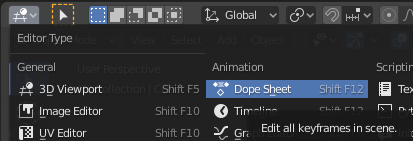
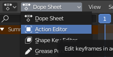
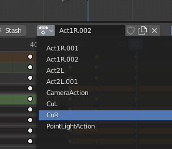
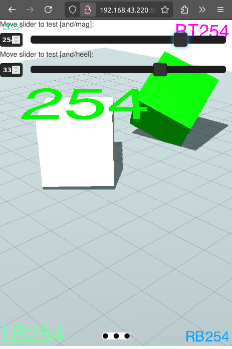

# 3d action clips - test

Exploring / playground for threejs. This time playing with clips from *.gbl file to have animation defined in blender.

### for what it is?

Blender as a 3d program have lot grater tools to make seekwance of key fromes / animations with objects. If you use **Action Editor**. It's a future you can find it in Editor type 

* Bope Steet
  
  

* Action Editor
  
  

So now yo can do all **magic** in time sequancer in blender using it tool to change state of the objects / lights / ...



Using **naming sceem** of actions (clips) you can have access to them in **yss site**. This example is touching the surface but it can:

* play in loop defined clip

* seek

* manually force render (I don't want loop with infinite render. It render only on change!)

Slider are for debug only but if you feed it with:

**msg** type: json **example** 

```json
{ msg: "and/msg", payload: int }
```

**where int** - 0...100


or


**msg** type: json **example**

```json
{ msg: "and/heel", payload: int }
```

**where int** - 0...100


## Screenshots



---

If you see that this makes sense [ send me a ☕ ](https://ko-fi.com/B0B0DFYGS) | [Master repository](https://github.com/yOyOeK1/oiyshTerminal) | [About SvOiysh](https://www.youtube.com/@svoiysh)
