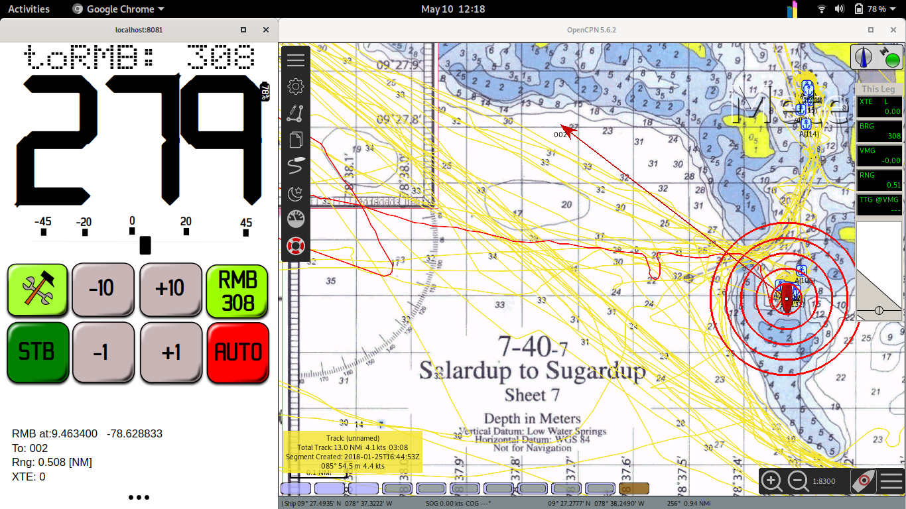
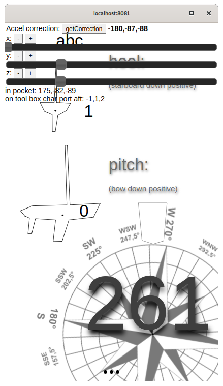

# Autopilot v3 svg

Boat as a element in a environment, water interacting with mass, accelerations, forces, heading. 

We want go there ! Big **<mark>STB</mark>** and **<mark>AUTO</mark>**

Ok to a way point set up on openCpn "**<mark>RNB</mark>**" mode (I call it). 

## Screenshots

*running next to opencpn. Communication ower nmea0183 RMB package process by autopilot and going to waypoint **002***

*calibration step, aligning heel, pitch, magnetic heading*

### TODO

- [ ] make a installer!
