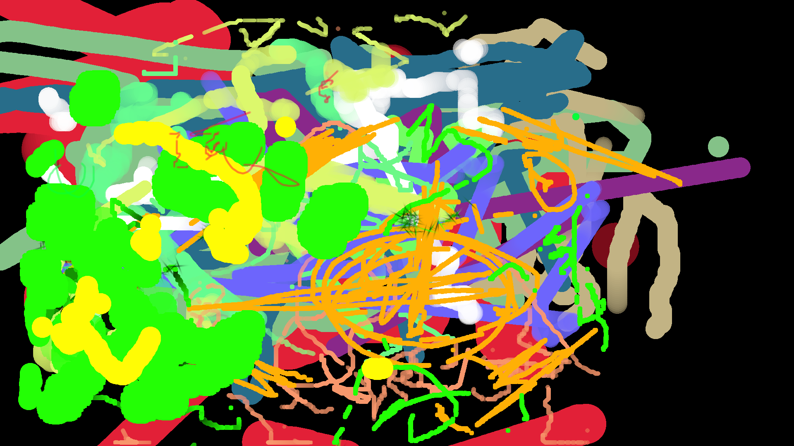

# Draw Pencile Emulator

To emulate draw pencile on your device. With data comming from external device / locac.

**host ./bin/drawPencilEmu/main.py**
Part in `python3` running on host where you want to have input of `drawing tablet` to be emited.

It connect it self to webSocket server and listen to upcomming messages from `client`
If message with touch data (in this moment) comes
It emulate this data as pencil device. 

**client sending device**
Phone with webbrowser on **yss** / **site** / `Drawing tablet`
Currently all touch's off screen / multitouch will be send to `host` 

### Testet on Gimp :) first skatch :...)

Ok so at this point it's starting to be interesting.
Now I can draw / pressure. Experiments with some basic gestures.
Click?, Scroll?

tbc...

---

As you can see I'm really good artist. Tool is working as proof of concept but need some improvements.

### pressure

Currently I'm harvesting data from touchscreen from phone. It have `force` value. But it's not so sensitive like I was expecting it to be :( With some code magic it was possible to emulate point of making `click` but talking about pressure detection, yyyy not so much. 

### future

Custom keyboards as more inputs for your projects?

Custom controls for apps?
