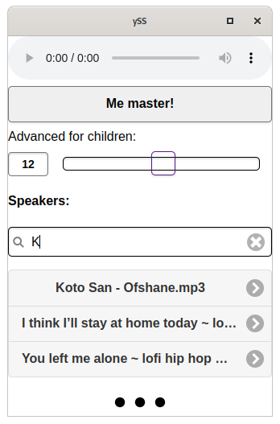
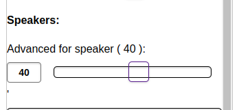

# music sinc

Bum bumbum bum bum. It's nice to have nice sound system rigdup. In my case I have a car stereo with bluethooth, bluetooth speaker and many other devices with wifi and spekers. YYY what? Phone/ tablet / laptop / every thing with web brawser and working speaker will do!

## Master plan! bum bum.

All devices are on music sinc site. Someone is becoming **Me master!** Selecting song from list and on all connected devices speakers are is use now, ~~sync and playing in union!

Bum bum.

It's creating interesting party delay / echo vibe.

## Future / Bug

All devices have different delay in processing to spitting out sound. Sometimes it's close to 5ms. But bluetooth speaker will do 300ms delay. So now every speaker in system hove Advanced ms per speaker :)

Or **My delay** on device to the relation of the rest.
