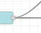
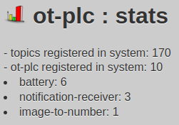
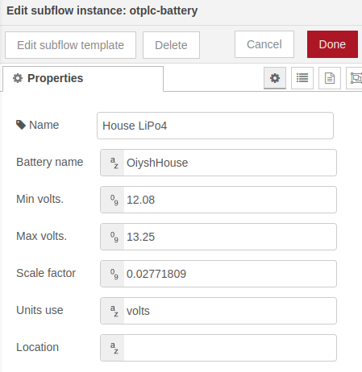

## otdm-yss-otplc

   Is a place to make / set / view / ... all about your known traffic of data. Is a place to set up your units / types / config ot-plc

Hawing so much data coming in and out it's easy to lost the track of what is what. ot-plc to the rescue! Is a abstract layer over your traffic. Is not important how complex is your ot-plc device. 

Currently it's a small mass. Little bit in yss little bit in Node-RED ... 

- Example can be `button` - is one incoming signal on momentary press of it. So event will be on press, release. Defining source as [mqtt|websocket|node in Node-RED|other ot-plc] it this example of `button` is one. Setting up name, location and that it's a momentary button is allowing as later to list types of ot-plc's.

- Example can be `battery` - is one of signals incoming as a one more time [mqtt|websocket|node in Node-RED|other ot-plc] it this example adc reading or some form of number. By setting up battery is then known range of `isNormal` status. We get `nLevel` from 0.0 ... 1.0 of it, factor if reader is linear. (Check screenshots section...)

- Example can be `image-to-number` - is one of signals incoming from remote-camera. By setting up cropping and some other options. You have number then can send it .... 
  
  

## why ot-plc?

Is a clean way to organize channels, normalize data, make massive data recording / analysis, ....

Extract from system info fast on subject of specific type of device you are looking for or building.

## status

working on / manual installation 

## screenshots

#### ot-plcs statistics

*instant information about health of your system*

#### ot-plc battery configuration

*so all batteries are the same...*

## notes
