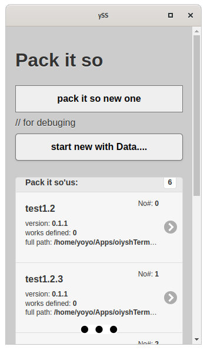
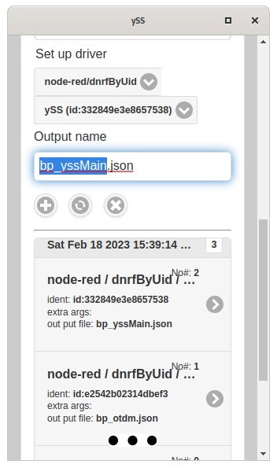

# otdm-yss-packitso

It is a yss site otdm-yss-packitso web front end. Pack from otdm- family.

Easy way to deploy your stuff to otdm- family. Otdm-tools have build in driver proto layer. This is giving as a way to make a simple work in places. Word "work" in in meaning swap enable actions ( Node-RED flow, Grafana dashboard, yss-site, bash script, .... ) If word "work" in replaceable we have a combo box to select from types of available works. Selecting what to do to make a .deb. It adds all marginal scripts. Only to install / remove it as a .deb. Prepare selection to deployment to .deb

It use it's home directory as a storage for pack it so sets. Directory is located in `.otdm/yss-packitso` In it you have folders `./p-*` those are the pack it so folders.
In it you have `packitso.json` having all information needed for `otdmTool` to do backgroud work. It's created by `otdm-yss-packitso`

## Using it - pack it so

From main select "pack it so".

Easy. Select host / source from where you want to make a work on. Then select type of work. Then select what to take to deployment. Set dir, name, description, author. Deploy...

Clean / Save / Deploy

## Status of coding

It's important section. This is still in progress project. It's to big to do it all at once :)

So **what we have** what **TODO**:

- [x] Main page

- [x] List of pack it so'us

- [x] Start new one

- [x] Save as new

- [ ] Save as overwrite

- [ ] otdm-tools handlers ....

- [ ] Deploying pack it so as .deb 

- [ ] Examples, tutorials

- [ ] rest..... ( oiyshTerminal - otdm all this repo final version )

## Screenshots of the site

|                                                           | whats on the photo                                                                                               |
| --------------------------------------------------------- | ---------------------------------------------------------------------------------------------------------------- |
|  | Main page of Pack it so. Super touch friendly using mApp. You can start new pack it so or edit on from directory |
|                              | Editing pack it so ./p-nameOfPack/packitso.json This is a gate to have .deb with packitso solution               |
