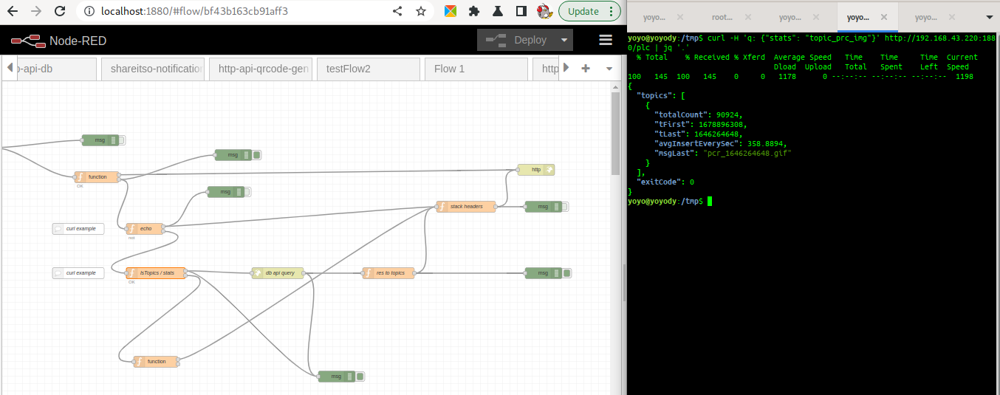

## otdmp-nrf-http-api-plc

   Is for getting information about your plc's in your system. So if you can do http you can have some interaction / information about this system. This a one place to explore ins and outs lets say ...


It's a in progress package / experimental / interesting


## is doing it....

First of all it's working at http://....:1880/plc

Second is that all queries to it need to be send in headers. Example curl to get echo from api...

```bash
curl -H 'q: {"echo": "abc"}' http://192.168.43.220:1880/plc | jq '.'
```

**Returns** {json} 

```json
{
  "msg": "echoBackAPI: abc END ECHO",
  "exitCode": 0
}
```

## if q {json}

"echo" {string} - will echo string back as json

"lsTopics" {string} - any string but key will return topics in system

 "stats" {string:tName} - to get statistics on topic

"avg" {string:tName} - to gen avg reading from 60 sec

    "sec" {int} - optional to avg form sec defined 

## status

in progress

- [x] listing db topics
  
  - [x] statistics

- [ ] listing virtual topics

- [ ] topic type information / staticsics ( so description of leaf / sensor )
  
  - [ ] type of msg / string / int / need some post processing / scale?
  
  - [ ] name of it
  
  - [ ] unit name

- [ ] ot-plc for Node-RED
  
  - [x] phantom to battery node
  
  - [x] notification system to http api
  
  - [ ] GPS device
  
  - [ ] accelerometer sensor device
  
  - [ ] compass device
  
  - [ ] swith
  
  - [ ] button
  
  - [ ] relay
  
  - [ ] 
  
  

## imaging it!


This is my plan of attack for this. imagining it is in ver 0.1 but beside insaine amout of coding I don't see problems. Can you? 

Left column is devices / phones / esp / arduinos / cars / boats / rv / green houses / solar panel installation / diy rice cooker / ...

They are reporting in shortest possible way. If it's a esp in your home then it's in range of your WiFi. If it's a car and it have dedicated phone then it have WiFi if it's in your home. In `Scout Mode` it have gsm to pub at on-line mqtt broker server if you want it to do so.

Otdm plc API is aggregating traffic from all known sources. 

It have `Bundles` with names. So define `Sensors` on `IN`. This approach is giving you switches if you want or virtual `Alarm sound/light` 

  

## example

* phantom to battery node in Node-RED ver 0.0.1 *it's experiment*
  
  

*setting up your mqtt topics to phantom to battery node is linking it from topic to grafana. It have from different sources different types of payload coming. With minimum of setting for defining a battery instance we get ...*

    

Node return json ....

```json
{
    "topic":"and/plcBat/OiyshHouse",
    "volts":12.94434803,
    "nLevel":0.7717393125000008,
    "isMin":false,
    "isMax":false,
    "isNormal":true,
    "unit":"volts",
    "hz":0.03321597023849067,
    "_msgid":"153af76f017268df"
}
```

**topic**: and/plcBac/`Battery name` is used as one of not recorded and stored in db so it's virtual and temporary.

**volts**: after making math operation with set `Scale factor`

**nLevel**: 0-1 base on set Min and Max


And in grafana generated on base of fact that node instance is existing in Node-RED is generating views for every battery in **ot-plc** So By selecting one battery or all you get this as a result ...


## screenshots



*in all it's glory. On left flow in Node-RED. On right terminal with statistics of one of the topics*


## notes


## todo

[] - battery more outputs to send notifications on: isXxxx, timeout, others ...
