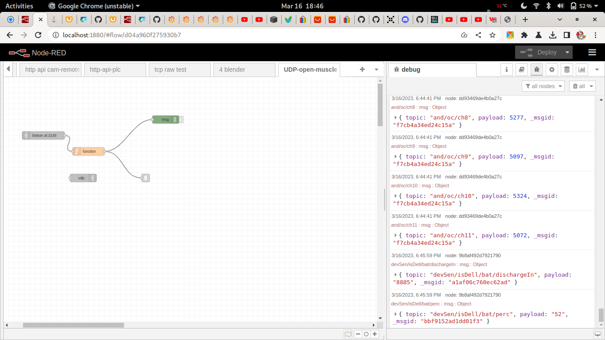
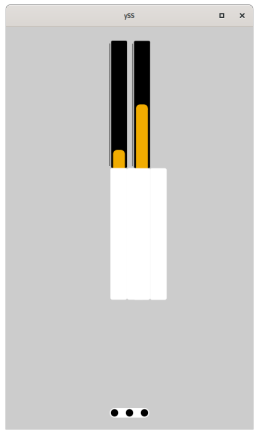

## otdmp-open-muscle-rc

   Is a cooperation with open-muscle to build telemetry instrument as a proof of koncept if OT can !

Open muscle project is at github: https://github.com/turfptax/openmuscle


Data upcomming from sensor in by udp in format json. Example row

```json
{
    'id': 'OM-Band12', 
    'time': (2023, 3, 12, 22, 23, 59, 6, 71), 
    'data': [1336, 5012, 5161, 4917, 5084, 5092, 5181, 5000, 5044, 4832, 5257, 4869], 
    'ticks': 187680, 
    'rec_time': 46.03442692756653
}


```

*this is nice formated for easy reading. Normally data is one line*


There is a Node-RED flow helper to transfer udp upcoming line by line data to something more usable for yss. Then data is send to Websocket layer to show it on yss. This is open what can be done with the data. By sending it to mqtt it will be stored. But there is a lot of it It will be nice to make custom data set in db.


## status

## screenshots

## 

*flow helper*




*first vesion bars are moving*


## notes

cat ./datasetTWO.txt | while read -r line; do echo $line; echo $line| nc -u localhost 3145 -w 1; done


