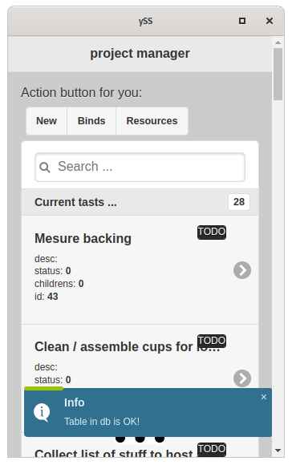
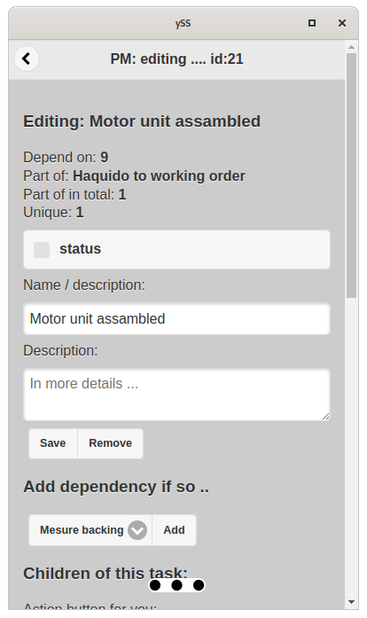
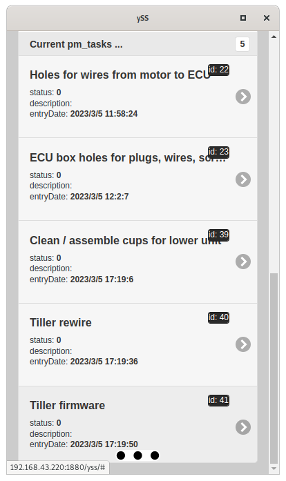
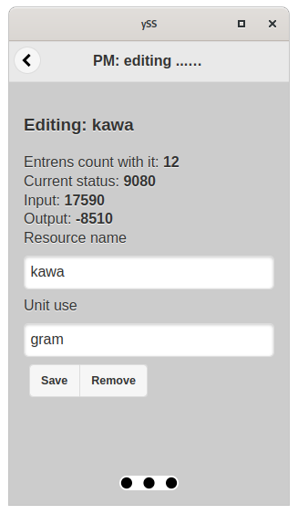

## otdm-yss-project-manager

   It's my attempt to organize in my way the mess subject of tasks and dependencies of other tasks, shopping lists, ....  

It's eliminates a lottery what is selection. This is a list Bum you can do this ....

## status

Usable / some bugs / no released

## screenshots

| Image                        | what is on it                                                            |
| ---------------------------- | ------------------------------------------------------------------------ |
|       | main page of project manager. This is a list to start doing things.      |
|      | task and some info of it. Element of a bigger project.                   |
|  | children's task to do first. Then task `Motor unit assembled` will be OK |
|       | it will connect to resources                                             |

## notes
