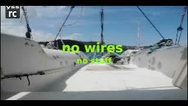

## otdm-yss-remote-camera

   Is for having a way to source pictures from devices you have. So if you have something with web browser is able to enter yss site and have camera you can use it with this to source images to your system. 

Then it can be process by other mechanism: image recognition, alarm security, timelaps, ...

There is currently two ways how to use it.

**As master** - so you stay on page and manage or look ...

**As device client** - so you need to have your `device name` and then go to one of the links to change hosting to https This step is allowing us to source sensors data from visiting device. So if device client have yyyy magnetometer, it can be a compass source, if camera then digital eye on something (engine room, back yard fance,...), light sensor to know if .....

Client are **POST**ing there data to https local server running at :4443 port

It's store data as files in `./yss/sites/remote-camera/localHttps/*.base64`

Then request http to node-red api broadcasting new item over webSocket

So in three clicks you have a remote camera.

It use yss/libs and can do https to http bridging.

## status

in progress...

- [x] https server for hosting media sourcing web page

- [x] https POST receiver to process posting data

- [x] pushing info about new file to WebSocket 

- [x] clients identification

- [ ] source sensors from device
  
  - [x] camera
  
  - [ ] cameras
  
  - [ ] accelerometers
  
  - [ ] magnetometer
  
  - [ ] gyroscope
  
  - [ ] ambient light sensor
  
  - [ ] absolute orientation sensor (for scout actions)

- [ ] manager iterations cpu consumption

- [ ] others ...

## screenshots

 [watch on youtube...](https://www.youtube.com/watch?v=OmMZG9lFIm8)

## notes
