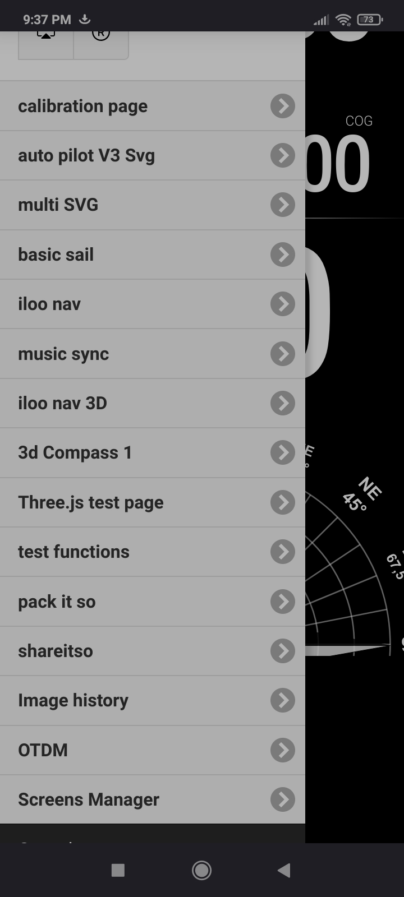
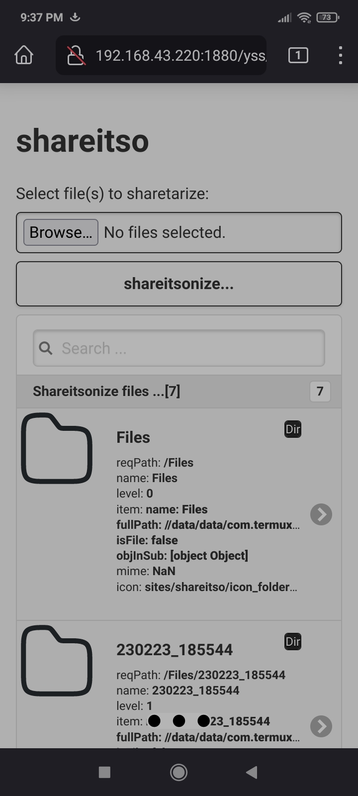

## otdm-yss-shareitso

   Is for making sharing text, links, files fast. In internal network all devices are yours. So this is share it so to other your device on yss site. 

## status

Usable / TODO need work in service and .deb setting up section

## screenshots

| image                  | what is on it                                                                                                                           |
| ---------------------- | --------------------------------------------------------------------------------------------------------------------------------------- |
|     | in action show case [video link ...](https://www.youtube.com/watch?v=74lI6NzLUF8)                                                       |
|    | shareitso is in yss site set. Can be access by menu or by http://...1880/yss/#pageByName=shareitso                                      |
|  | list of last shareitsonized files :) Some mime type recognition, audio can be play from page. No need of installing any thing on client |
|    | now for instance analog / digital share of msg's it do qrcode for ...                                                                   |
|                        |                                                                                                                                         |

## notes
