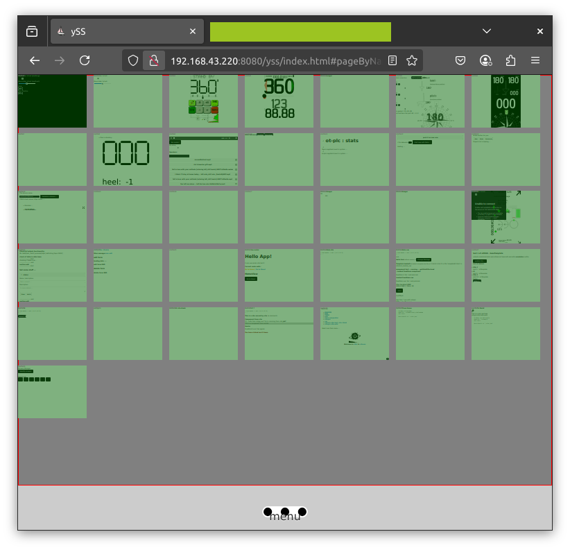
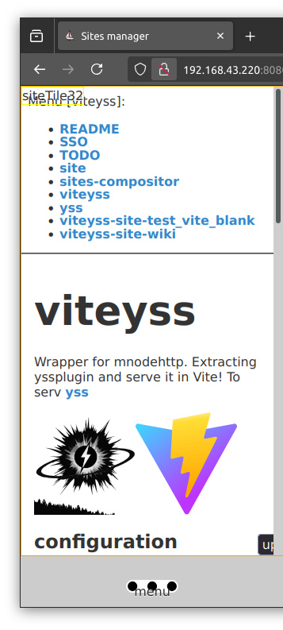

# Sites manager

To make site live without interruptions.

Init all sites on personal domElement / tile.
On screenshots 

## Screenshots

One **tile** one **site** clicking on one is bringing it to 100% scale and starting to be interactive.

Clicking **wiki** brings 100% scale site. 

### Current 

Not so good :( but !

#### life cicle of site

1. include / import
2. init
3. put into array and json
4. invoke of `getHtml` then `svgDyno`
5. fallowd by `getHtmlAfterLoad()` then `svgDynoAfterLoad()`
6. on page left site gets `onPageLeft()`

Cia

#### at site change

On every site change you go from
life cicle of site step `4.`, `5.`
Site is considure to be loaded, **interactive**.

now what?
on change site go do `at site change`
