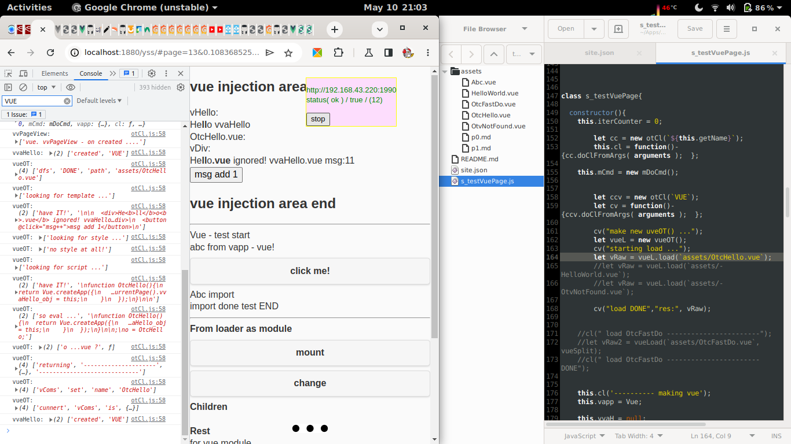

## p-test-vue

   Is test vue.js site. From this directory you can look for examples how to use `.vue` files in `otdm-yss`

## status

manual installation only / as code working  

## screenshots

**status for 23-05-20**



lot is going on. Bu `left` debug of browser showing logs loading `.vue` file `middle` still in browser site `test vue` some playground stuff is going on. on `right` gedit with directory and one line import and mount **work in progres**

#### temporary use

to mount `.vue` to DOM element by it `id` equal `divh` in this example

* html site
  *you have it in some section*

  ```html
  ...ection area start </h2>
  OtcHello.vue - from loader to div by id
  <div id="divh"></div>
  vHel....
  ```

* javascript site - where you whant to use / inject it
  *this is importing `OtcHello.vue` file to `id="divh"` like so*

  ```javascript
  let vueL = new vueOT();
  vueL.load(`assets/OtcHello.vue`,"divh",(r)=>{    console.log("OtcHello loader callback handler","vue","status",r);   });
  ```

* check `OtcHello.vue` what is the difference currently from vue.js vanilla [link](./assets/OtcHello.vue)
